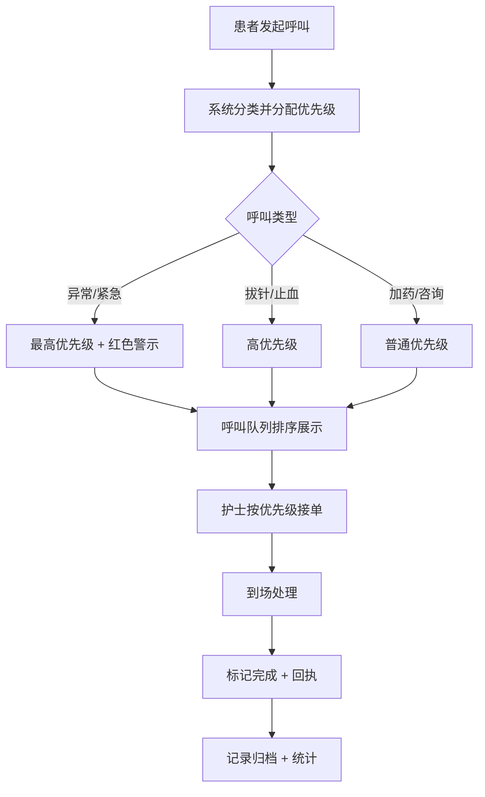

## 1. 产品概述

输液巡视智能呼叫器是一款面向医院输液区的智能管理系统，服务于护士、陪护家属和候诊患者三方用户。通过数字化呼叫和智能调度，减少患者及家属反复起身寻找护士的情况，提升输液区运营效率和患者满意度。

- 核心目标：实现输液区呼叫数字化、智能化管理，降低人工沟通成本
- 目标用户：输液区护士、陪护家属、候诊患者
- 市场价值：改善医患沟通体验，提高护士工作效率，减少医疗差错

## 2. 核心功能

### 2.1 用户角色

| 角色 | 登录方式 | 核心权限 |
|------|----------|----------|
| 护士 | 工号登录 | 查看呼叫队列、接单处理、巡视管理、异常处理、查看统计 |
| 患者/家属 | 座位号登录 | 一键呼叫、查看呼叫进度、暂停呼叫、查看服务记录 |
| 管理员 | 账号密码 | 全部功能权限、系统配置 |

### 2.2 功能模块

1. **输液座位图**：可视化展示输液区座位布局，实时显示座位状态和呼叫信息
2. **呼叫队列**：按优先级展示所有待处理呼叫，支持接单、合并、超时提醒
3. **巡视提醒**：定时巡视任务提醒，到点推送通知，支持标记完成
4. **异常处理**：处理输液异常情况（渗液、过敏、跑针等），高优先级调度
5. **服务记录**：历史服务记录查询、高峰时段统计、响应时长分析

### 2.3 页面详情

| 页面名称 | 模块名称 | 功能描述 |
|-----------|-------------|---------------------|
| 主控制台 | 输液座位图 | 6x8网格座位布局，颜色区分状态（空闲/输液中/呼叫中/处理中/异常），点击座位查看详情和发起呼叫 |
| 主控制台 | 呼叫队列 | 优先级排序卡片列表，显示座位号、呼叫类型、等待时长、接单按钮，超时高亮闪烁 |
| 主控制台 | 巡视提醒 | 巡视时间轴，到点弹窗提醒，一键标记已巡视，支持临时跳过 |
| 主控制台 | 异常处理 | 异常呼叫独立展示区，红色警示，优先处理，记录异常类型和处置结果 |
| 主控制台 | 服务记录 | 时间筛选、类型筛选的记录列表，高峰时段热力图统计，平均响应时长展示 |
| 患者呼叫端 | 呼叫面板 | 大按钮呼叫入口（加药/拔针/止血/咨询/其他），呼叫进度状态条，队列位置提示 |
| 患者呼叫端 | 状态展示 | 座位输液进度条，预计完成时间，护士预计到达时间 |
| 设置页面 | 系统配置 | 夜间模式开关、超时阈值设置、巡视周期配置、声音提醒设置 |

## 3. 核心流程

### 3.1 患者呼叫流程
患者点击对应呼叫类型按钮 → 系统记录呼叫信息并按类型分配优先级 → 呼叫进入队列同时座位图高亮 → 护士端按优先级接单 → 护士到达处理 → 处理完成标记 → 患者端显示处理完成回执 → 记录归档

### 3.2 护士巡视流程
系统按预设周期生成巡视任务 → 到点推送提醒（声音+弹窗） → 护士巡视并勾选完成 → 如发现异常立即转异常处理流程 → 巡视记录归档

### 3.3 异常处理流程
患者/护士发起异常呼叫 → 系统标记最高优先级并红色警示 → 自动通知最近护士 → 护士接单到场处置 → 记录异常类型和处理结果 → 严重情况升级通知医生

## 4. 用户界面设计

### 4.1 设计风格
- **主色调**：医疗蓝（#2563EB）为主色，搭配柔和薄荷绿（#10B981）表示正常，警示红（#EF4444）表示异常，温暖橙（#F59E0B）表示等待中
- **按钮风格**：圆润大按钮（圆角16px），带轻微阴影，按压有下沉效果，紧急按钮带脉冲动画
- **字体**：中文使用思源黑体（Noto Sans SC），标题700加粗，正文400常规，数字等宽显示
- **布局风格**：卡片式布局，分区清晰，支持分栏拖拽，重要信息固定展示
- **图标风格**：使用Lucide线性图标，配合颜色语义，异常状态图标带红色圆点标记

### 4.2 页面设计概览

| 页面名称 | 模块名称 | UI元素 |
|-----------|-------------|-------------|
| 主控制台 | 输液座位图 | 网格卡片布局，状态色边框，悬停放大效果，呼叫状态脉冲动画 |
| 主控制台 | 呼叫队列 | 列表卡片，优先级标签彩色，等待时长进度条，接单按钮，超时闪烁 |
| 主控制台 | 巡视提醒 | 时间轴设计，完成项绿色勾选，当前项蓝色高亮，下一项灰色预览 |
| 主控制台 | 异常处理 | 红色边框卡片，异常标签，处置表单，紧急程度指示器 |
| 主控制台 | 服务记录 | 统计卡片（响应时长、处理数量、高峰时段），可筛选表格 |
| 患者呼叫端 | 呼叫面板 | 四象限大按钮布局，图标+文字，进度条显示队列位置 |

### 4.3 响应式设计
- 桌面优先设计（护士端1920x1080），适配双屏显示器
- 平板端（iPad）适配护士移动查房场景
- 手机端精简版用于患者家属微信扫码访问
- 所有可点击元素最小44x44px触控区域

### 4.4 交互动效
- 座位呼叫时：边框呼吸灯脉冲动画 + 轻微放大
- 新呼叫进入队列：从右侧滑入 + 声音提醒
- 接单处理：卡片背景渐变为蓝色处理中状态
- 处理完成：绿色对勾动画弹出 + 回执消息
- 超时未处理：卡片红色闪烁 + 升级提醒
- 夜间模式：全局切换为深色护眼主题，降低对比度
