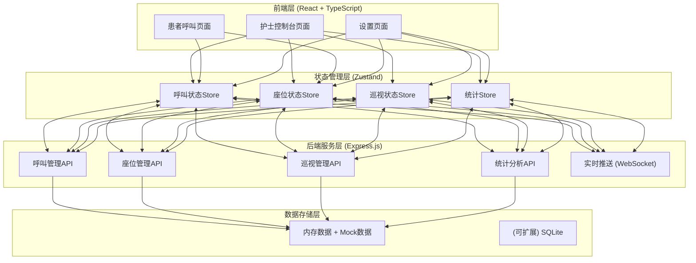
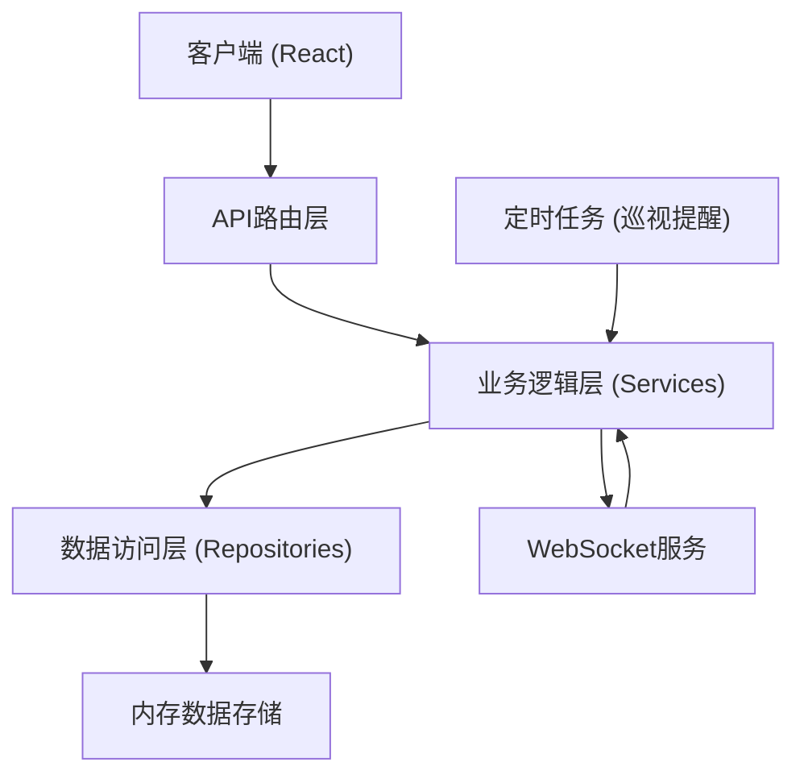
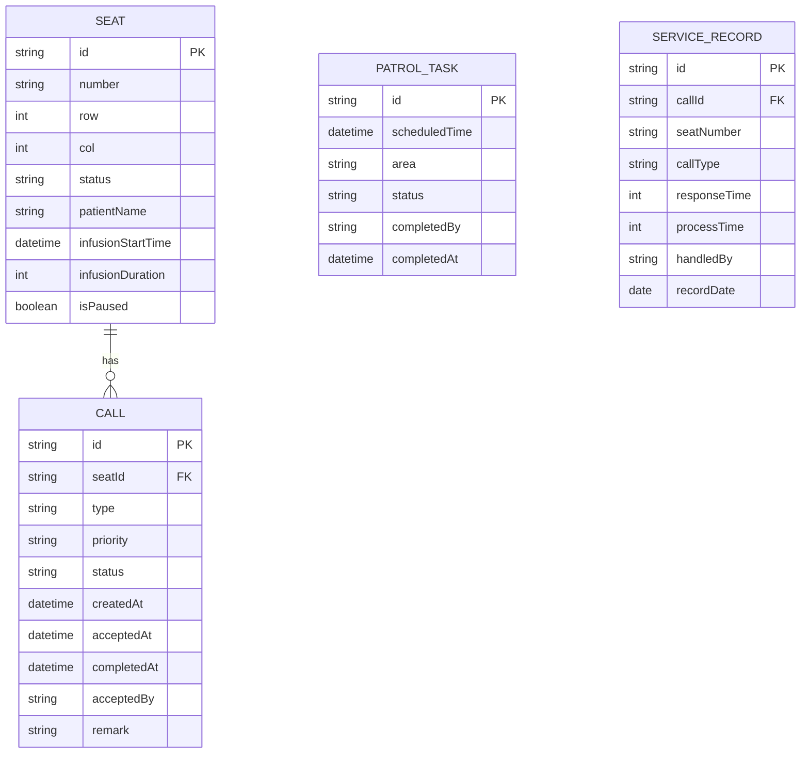

## 1. 架构设计



## 2. 技术描述

- **前端**：React@18 + TypeScript + Vite + TailwindCSS@3 + Zustand + Lucide React
- **初始化工具**：vite-init (react-express-ts模板)
- **后端**：Express.js@4 + TypeScript + WebSocket (ws)
- **数据库**：使用内存Mock数据，演示用
- **实时通信**：WebSocket实现呼叫状态实时同步
- **图标库**：lucide-react

## 3. 路由定义

| 路由 | 用途 |
|-------|---------|
| / | 护士主控制台（座位图+呼叫队列+巡视提醒+异常处理+服务记录） |
| /patient/:seatId | 患者呼叫端页面（扫码进入指定座位） |
| /settings | 系统设置页面 |

## 4. API定义

```typescript
// 呼叫类型
type CallType = 'medication' | 'remove_needle' | 'hemostasis' | 'consultation' | 'abnormal' | 'other';
type CallPriority = 'urgent' | 'high' | 'normal' | 'low';
type CallStatus = 'pending' | 'accepted' | 'processing' | 'completed' | 'cancelled' | 'timeout';
type SeatStatus = 'idle' | 'infusing' | 'calling' | 'processing' | 'abnormal';

interface CallRecord {
  id: string;
  seatId: string;
  seatNumber: string;
  type: CallType;
  priority: CallPriority;
  status: CallStatus;
  patientName?: string;
  createdAt: number;
  acceptedAt?: number;
  completedAt?: number;
  timeoutAt?: number;
  acceptedBy?: string;
  remark?: string;
  abnormalType?: string;
}

interface Seat {
  id: string;
  number: string;
  row: number;
  col: number;
  status: SeatStatus;
  patientName?: string;
  infusionStartTime?: number;
  infusionDuration?: number; // 分钟
  currentCallId?: string;
  isPaused?: boolean;
}

interface PatrolTask {
  id: string;
  scheduledTime: number;
  area: string;
  status: 'pending' | 'completed' | 'skipped';
  completedBy?: string;
  completedAt?: number;
  remark?: string;
}

// API 接口
GET  /api/seats              // 获取所有座位状态
GET  /api/seats/:id          // 获取单个座位详情
PUT  /api/seats/:id          // 更新座位信息

GET  /api/calls              // 获取呼叫列表（支持status筛选）
POST /api/calls              // 创建新呼叫
PUT  /api/calls/:id/accept   // 接单
PUT  /api/calls/:id/complete // 完成处理
PUT  /api/calls/:id/cancel   // 取消呼叫
PUT  /api/calls/merge        // 合并同类呼叫

GET  /api/patrols            // 获取巡视任务列表
POST /api/patrols            // 创建巡视任务
PUT  /api/patrols/:id        // 更新巡视状态

GET  /api/statistics         // 获取统计数据（今日处理量、平均响应时长、高峰时段）
GET  /api/records            // 获取历史服务记录
```

## 5. 服务端架构



### 目录结构
```
api/
  ├── index.ts              # Express入口
  ├── routes/
  │   ├── seats.ts          # 座位路由
  │   ├── calls.ts          # 呼叫路由
  │   ├── patrols.ts        # 巡视路由
  │   └── statistics.ts     # 统计路由
  ├── services/
  │   ├── SeatService.ts    # 座位业务逻辑
  │   ├── CallService.ts    # 呼叫业务逻辑
  │   ├── PatrolService.ts  # 巡视业务逻辑
  │   └── StatService.ts    # 统计业务逻辑
  ├── stores/
  │   └── MemoryStore.ts    # 内存数据存储
  ├── ws/
  │   └── WebSocketServer.ts # WebSocket服务
  └── utils/
      └── mockData.ts       # Mock数据生成
      
src/
  ├── pages/
  │   ├── Dashboard.tsx     # 护士主控制台
  │   ├── PatientView.tsx   # 患者呼叫端
  │   └── Settings.tsx      # 设置页面
  ├── components/
  │   ├── seat/             # 座位图组件
  │   ├── call/             # 呼叫队列组件
  │   ├── patrol/           # 巡视提醒组件
  │   ├── abnormal/         # 异常处理组件
  │   ├── record/           # 服务记录组件
  │   └── common/           # 公共组件
  ├── stores/
  │   ├── useSeatStore.ts   # 座位状态
  │   ├── useCallStore.ts   # 呼叫状态
  │   ├── usePatrolStore.ts # 巡视状态
  │   └── useSettingStore.ts# 设置状态
  ├── hooks/
  │   ├── useWebSocket.ts   # WebSocket连接
  │   └── useAudio.ts       # 声音提醒
  └── types/
      └── index.ts          # 类型定义
```

## 6. 数据模型

### 6.1 实体关系图



### 6.2 优先级规则

| 呼叫类型 | 优先级 | 超时阈值 | 说明 |
|---------|--------|---------|------|
| abnormal（异常） | urgent（紧急） | 2分钟 | 最高优先级，立即通知 |
| hemostasis（止血） | high（高） | 3分钟 | 需尽快处理 |
| remove_needle（拔针） | high（高） | 5分钟 | 输液完成需及时 |
| medication（加药） | normal（普通） | 8分钟 | 常规操作 |
| consultation（咨询） | low（低） | 15分钟 | 可延后处理 |
| other（其他） | low（低） | 15分钟 | 视情况处理 |

### 6.3 同类呼叫合并规则
- 相同呼叫类型（如加药）且座位在同一区域（相邻3个座位内）
- 时间窗口：5分钟内发起的同类型呼叫
- 合并后主呼叫保留，子呼叫关联显示，处理完成后全部标记完成
